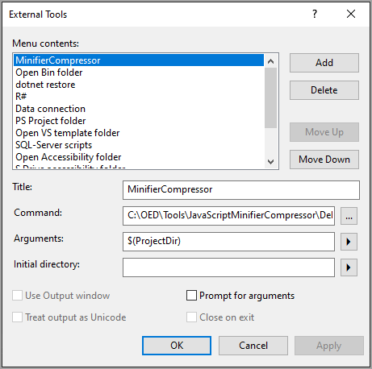
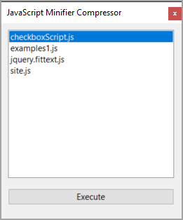
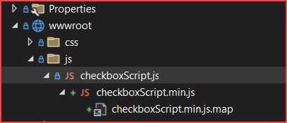

# Visual Studio JavaScript minifier / compressor

This article intent is to make minifying your JavaScript files improves initial parse time using [uglify-js](https://www.npmjs.com/package/uglify-js) which is a free library which is typically used at the command line, here in a Windows Forms application called in Microsoft Visual Studio by adding the application to Visual Studio’s external tools.

The reason for using a Windows Form application is simple, no need to leave Visual Studio or depend on a Visual Studio extension which may not be supported in later versions of Visual Studio. Also, a developer having simply source code can easily modify the code, for instance, change options and also change the executable called which can also be depreciated. Another reason for using this utility, no need to remember options sent to the utility.

## Important notes

- The tool has been configured to work for ASP.NET Core or Razor Pages projects only but the code is easy to modify for other project types.
- After using this utility to minify and create a map file, if a developer makes changes to the main JavaScript file outside of comments this utility must run again, no different than using uglify-js at the command line.


## Step 1: Install uglify-js

Best to install globally using the following command via PowerShell window.

```powershell
npm install uglify-js -g
```

## Step 2: Clone/Build

- Clone the source repository
- Open the solution in Visual Studio 2022 or later
- Build the project

## Step 3: Add to external tools

From Visual Studio Tool menu

- Click External Tools...
- Click the Add button and fill in the inputs
    - Title: MinifierCompressor (or whatever you want)
    - Command: Select the .exe for this project
    - Arguments: $(ProjectDir)
- Click Save




## Try it out

Select a file and click Execute button. The update can be seen immediately in Solution Explorer.






## Why not offer multiple selections?

Could have but want to keep it simple. If a developer is not comfortable altering code for this and I get enough request I will modify to permit multiple files at once.

## Source code

Clone the following GitHub repository.

